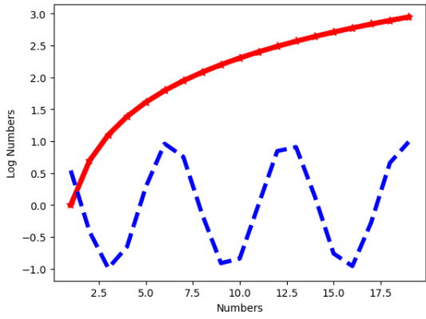
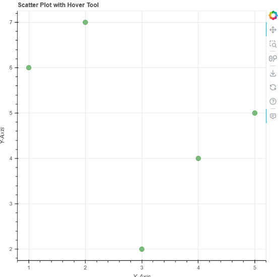
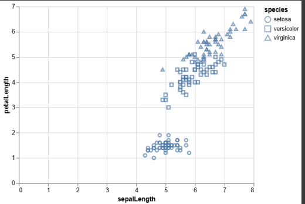
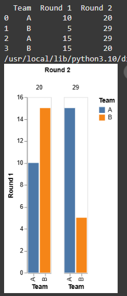
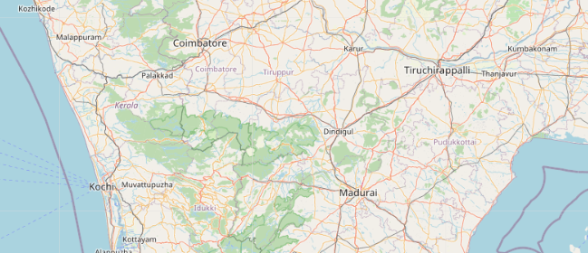

# Exno 4:APPDS
## Aim:

To Implement Advanced Visualizations and Geospatial Data using python.
## Algorithm:

Step 1: Include the necessary libraries.

Step 2: Add the necessary values to the initialized variables.

Step 3: Install the advanced python necessary libraries such as pygal,plotnine,altair etc. 

Step 4: Use the necessary arguments for the functions used from advanced library.

Step 5: Import Geopandas and folium.

Step 6: Use folium map function to display the map location.

## Program:
```
Developed by: Manoj Kumar S
Register no: 212221230056
```

```py
import numpy as np
import matplotlib.pyplot as plt
x=np.array([1,2,3,4,5,6,7,8,9,10])
y=np.tan(x)
z=np.sin(x)

plt.xlabel("Natural Numers")
plt.ylabel("TAN and SIN values")
plt.plot(x,y,'m',marker='*',markersize=8,markeredgecolor='red')
plt.plot(x,z,'b',linewidth=4,linestyle='--')
plt.title("TAN and SIN values")
plt.legend(["TAN","SIN"])
plt.show()

a=np.arange(1,20)
b=np.log(a)
c=np.cos(a)
plt.xlabel("Numbers")
plt.ylabel("Log Numbers")
plt.plot(a,b,'r',marker='*',markersize=8,markeredgecolor='red',linewidth=5)
plt.plot(a,c,'b',linewidth=4,linestyle='--',markersize=8,markeredgecolor='blue')

import pygal
from pygal.style import Style
# Create a custom style
custom_style= Style(
background="transparent",
plot_background="transparent",
foreground='red',
foreground_strong='blue',
foreground_subtle='yellow',
opacity='.6',
opacity_hover='.9',
transition='400ms',
colors=('#E80080', '#404040')
)
#Create a line chart
line_chart= pygal.Line(style=custom_style, show_legend=True, x_title='Months', y_title='Values')
line_chart.title ='Monthly Trends'
line_chart.add('Series 1', [1, 3, 5, 7, 9])
line_chart.add('Series 2', [2, 4, 6, 8, 10])
#Render the chart to a file
line_chart.render_to_file('line_chart.svg')

from bokeh.models import HoverTool
from bokeh.plotting import figure, show
from bokeh.io import output_notebook
output_notebook()
p=figure(title="Scatter Plot with Hover Tool",
         x_axis_label='X-Axis', y_axis_label='Y-Axis')
p.scatter(x=[1, 2, 3, 4, 5], y=[6, 7, 2, 4, 5], size=10, color="green", alpha=0.5)
# Add Hover Tool
hover= HoverTool()
hover.tooltips = [("X", "@x"), ("Y", "@y")]
p.add_tools (hover)
show(p)

import pandas as pd
import seaborn as sns
from plotnine import ggplot ,aes,facet_grid,labs,geom_col,theme_xkcd
df=sns.load_dataset("tips")
plot=(
    ggplot(df)
    +facet_grid("~sex")
    +aes(x="day", y="total_bill",fill="time")
    +labs(
        x="day",
        y="total_bill",
    )
    +geom_col()
    +theme_xkcd()
)
plot.save("gfg plotnine.png")

import altair as alt
import pandas as pd
score_data=pd.DataFrame({
    'Website': ['StackOverflow','FreeCodeCamp',"GeeksForGeeks","MDN","CodeAcademy"],
    'Score':[65,50,99,75,33]
})
alt.Chart(score_data).mark_bar().encode(
    x="Website",
    y="Score"
)

import altair as alt
from vega_datasets import data
iris=data.iris()
alt.Chart(iris).mark_point().encode(
    x='sepalLength',
    y='petalLength',
    shape='species'
)

import altair as alt
import pandas as pd
data=pd.DataFrame([['A',10,20],['B',5,29],['A',15,29],['B',15,20]],
                columns=['Team','Round 1','Round 2'] )
print(data)
gp_chart=alt.Chart(data).mark_bar().encode(
    alt.Column('Round 2'),alt.X('Team'),
    alt.Y("Round 1",axis=alt.Axis(grid=False)),
    alt.Color('Team'))
gp_chart.display()

import folium
import pandas as pd
m=folium.Map(location=[10.9, 77.519],zoom_start=7,title="TAMILNADU")
m.save('my_map.html')

```

## Output:








## Result:
We have successfully performed advanced visualization using geospatial data using python.